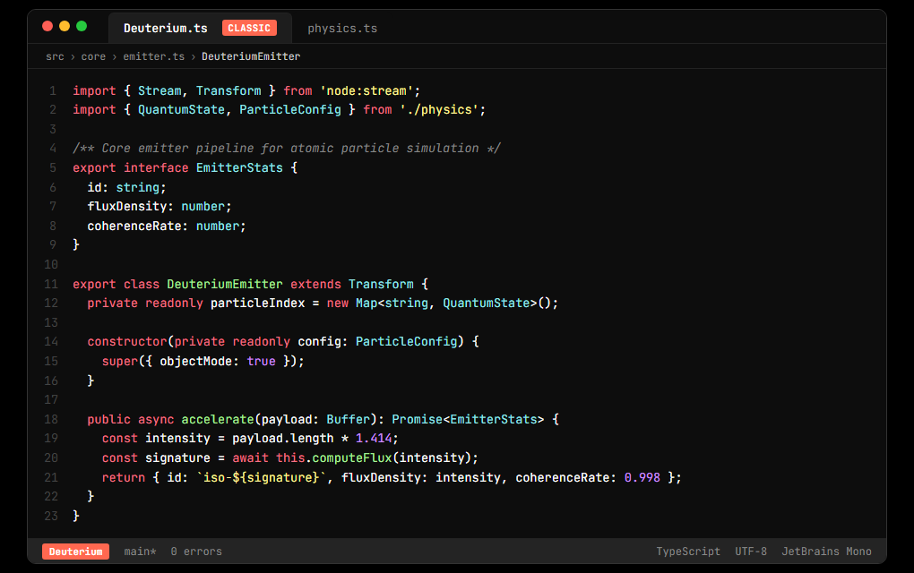
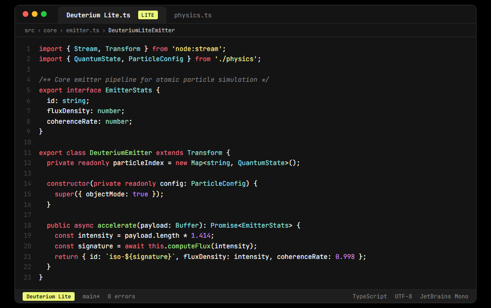

# Deuterium Color Themes

Dark, high-contrast color themes for Visual Studio Code and Antigravity IDE modeled after JetBrains color schemes. Available in two distinct variants: **Deuterium** and **Deuterium Lite**.

---

## 1. Download & Install

Install directly through your preferred extension marketplace:

- **[VS Code Marketplace](https://marketplace.visualstudio.com/items?itemName=andreidurlea.deutherium)**
- **[Open VSX Registry](https://open-vsx.org/extension/andreidurlea/deutherium)**

Alternatively, search for `Deuterium` in the Extensions view (`Ctrl+Shift+X` / `Cmd+Shift+X`) in Visual Studio Code or Antigravity IDE and select **Install**.

---

## 2. Theme Previews

### Deuterium (Classic)

---

### Deuterium Lite

---

## 3. Activation

1. Open the Color Theme picker using `Ctrl+K Ctrl+T` (or `Cmd+K Cmd+T` on macOS).
2. Select **Deuterium** or **Deuterium Lite**.

> [!TIP]
> For the intended typography and rendering, the [JetBrains Mono](https://fonts.google.com/download?family=JetBrains%20Mono) font is recommended.
